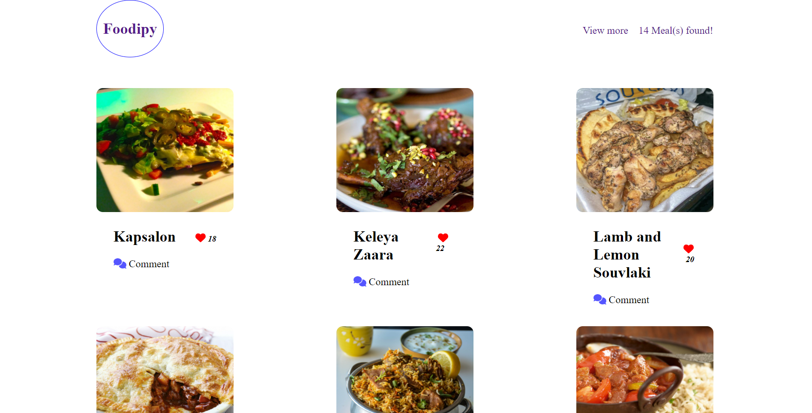

# Foodipy | JavaScript Capstone

> This is a group project being built in our second module of our curriculum at microverse. its a web application for listing all of the food sources and how to prepare them, using a video and an instruction guide


Our goal here is to Build an application that calls from a large data set of food from an API and also integrate some user involvement were you can like and comment on your favorite meal. click [here](https://harlexkhal.github.io/Foodipy/) to see deployed live version

### Features implemented so far are:

- Responsive HTML page
- Integrated webpack
- Integrated [MealDB API](https://www.themealdb.com/api.php)
- Integrated [Involvement API](https://www.notion.so/Involvement-API-869e60b5ad104603aa6db59e08150270)
- Addition of unit test using Jest.

## Built With

- Lighthouse (An open-source, automated tool for improving the quality of web pages. It has audits for performance, accessibility, progressive web apps, SEO and more).
- Webhint (A customizable linting tool that helps you improve your site's accessibility, speed, cross-browser compatibility, and more by checking your code for best practices and common errors).
- Stylelint (A mighty, modern linter that helps you avoid errors and enforce conventions in your styles).
- ESlint (A mighty, modern linter that helps you avoid errors and enforce conventions in JavaScript codes)
- Webpack (Used for bundling JavaScript files for usage in a browser)
- Jest (A JavaScript testing framework designed to ensure correctness of any JavaScript codebase. It allows you to write tests with an approachable, familiar and feature-rich API that gives you results quickly.)

To get a local copy up and running follow these simple example steps.

### Prerequisites

The basic requirements for building the executable are:

- A working browser application (Google chrome, Mozilla Fire fox, Microsoft edge ...)
- VSCode or any other equivalent code editor
- Node Package Manager (For installing packages like Lighthous, webhint & stylelint used for checking for debugging bad codes before deployment)

# Getting Started

#### Cloning the project

```
git clone  https://github.com/harlexkhal/Foodipy <Your-Build-Directory>
```

## Getting packages and dependencies
To get all package modules required to build the project run:
```
npm install
```
every package module required to build the project is listed in the package.json file. this is used as a reference to get all dependencies.

## Building 

To build the project run:
```
npm run build
```
after you run this sucessfully you'd locate the build from in the ```dist``` folder located from the parent directory of the project. two files are being built which are, ```core.js and index.html```

## Running

To run the program on a browser through a server run this command in your cli
```
npm start
```
This should open the page in your localhost on port 8080. then you'd be able to view the built page generated using webpack.

## Unit-Testing

You can find each unit test cases in the ```__Testbase__``` folder located in the parent source directory of the project. you can create your own custom unit test and test it by running
```
npm run test
```
This should run all unit test found in the ```unit.test.js``` from the ```__Testbase__``` folder.

## License

All source code files are licensed under the permissive zlib license
(http://opensource.org/licenses/Zlib) unless marked differently in a particular folder/file.

## Author
- **Mnemba Chambuya** -  [github](https://github.com/mnekx), LinkedIn: [linkein](https://linkedin.com/in/mnemba-chambuya), [twitter](https://twitter.com/MnembaChambuya)
- **Alexander Oguzie-Ibeh** - [github](https://github.com/harlexkhal), [linkedin](https://www.linkedin.com/in/alexander-oguzie-ibeh-776814164), [twitter](https://twitter.com/harlexkhal)
